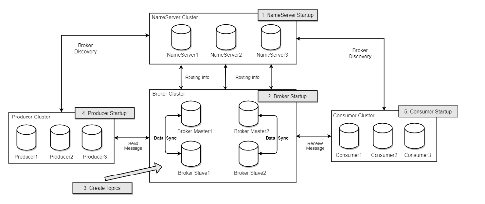

相关资源

| 服务名   | 地址                                    | 备注     |
| -------- | --------------------------------------- | -------- |
| jdk      | https://www.oracle.com/java/            |          |
| rocketmq | https://rocketmq.apache.org/download    |          |
| 控制台   | https://rocketmq.apache.org/zh/download | 两主两从 |



### **JDK 安装与环境配置步骤**（两主节点都需要）

#### **1. 下载 JDK 安装包**

从 Oracle 官网或官方镜像下载对应版本的 JDK 压缩包（示例为 `jdk-8u351-linux-x64.tar.gz`），上传至服务器的 `/opt` 目录（或通过 `wget` 直接下载）。

#### **2. 解压安装包**

```bash
# 切换到安装目录
cd /opt

# 解压 JDK 压缩包（-zxvf 表示解压 gzip 格式的 tar 包并显示过程）
tar -zxvf jdk-8u351-linux-x64.tar.gz
```

#### **3. 配置环境变量**

```bash
# 编辑系统全局环境变量文件（需 root 权限）
vim /etc/profile
# 配置 JDK 环境变量
export JAVA_HOME="/opt/jdk1.8.0_351"  # 指定 JDK 安装路径
export PATH="$PATH:$JAVA_HOME/bin"     # 将 JDK 可执行文件路径添加到系统 PATH
```

#### **4. 使配置立即生效**

```bash
# 重新加载环境变量配置文件，无需重启系统
source /etc/profile
```

#### **5. 验证安装结果**

```bash
# 查看 Java 版本信息，确认安装成功
java -version
```

### 安装 RocketMQ（两主节点都需要）

#### **1. 解压 RocketMQ 安装包**

```bash
# 解压安装包到当前目录
unzip rocketmq-all-5.1.0-bin-release.zip

# 建议移动到指定目录（如 /opt/rocketmq），方便管理
mv rocketmq-all-5.1.0-bin-release /opt/rocketmq/
```

#### **2. 配置环境变量**

```bash
# 编辑全局环境变量文件
sudo vim /etc/profile

# 在文件末尾添加以下内容（按实际安装路径修改）
export ROCKETMQ_HOME="/opt/rocketmq/rocketmq-all-5.1.0-bin-release"

# 使配置生效
source /etc/profile
```

#### **3. 调整 JVM 内存参数（关键优化）**

默认 JVM 内存设置较大，建议根据服务器配置调整（以 256M 为例，适用于测试环境）：

```bash
# 修改 NameServer 启动参数
vim $ROCKETMQ_HOME/bin/runserver.sh
# 找到 JAVA_OPT 配置行，修改为：
JAVA_OPT="${JAVA_OPT} -server -Xms256m -Xmx256m -Xmn128m"

# 修改 Broker 启动参数
vim $ROCKETMQ_HOME/bin/runbroker.sh
# 找到 JAVA_OPT 配置行，修改为：
JAVA_OPT="${JAVA_OPT} -server -Xms256m -Xmx256m"
JAVA_OPT="${JAVA_OPT} -XX:MaxDirectMemorySize=256m"

# 同步修改 mqnamesrv 和 mqbroker 脚本（确保参数生效）
vim $ROCKETMQ_HOME/bin/mqnamesrv
vim $ROCKETMQ_HOME/bin/mqbroker
# 确认其中引用了上述 runserver.sh 和 runbroker.sh 的配置
```

#### **4. 自定义日志目录与启停脚本**

##### **创建工作目录**

```bash
# 创建独立工作目录（统一管理日志和数据）
mkdir -p /opt/rocketmq/work && cd /opt/rocketmq/work
```

##### **编写 NameServer 启停脚本**（两节点一样）

```bash
# 创建脚本文件
vim namesrv-ctl.sh

# 脚本内容（按 i 进入编辑模式，粘贴后 :wq 保存）
#!/bin/bash
case $1 in
    start)
        # 指定日志存储目录为当前工作目录
        export JAVA_OPT="-Duser.home=$(pwd)"
        # 后台启动并输出日志
        nohup sh $ROCKETMQ_HOME/bin/mqnamesrv &
        echo "NameServer 启动成功"
        ;;
    stop)
        # 调用官方停止脚本
        sh $ROCKETMQ_HOME/bin/mqshutdown namesrv
        echo "NameServer 已停止"
        ;;
    *)
        echo "使用方法: namesrv-ctl.sh start | stop"
        ;;
esac

# 赋予执行权限
chmod +x namesrv-ctl.sh
```

##### **编写 Broker 启停脚本**（broker-a-master）

```bash
# 创建脚本文件
vim broker-ctl.sh

# 脚本内容
#!/bin/bash
case $1 in
    start)
        export JAVA_OPT="-Duser.home=$(pwd)"
        # 关联本地 NameServer（默认端口 9876），启用代理模式
        nohup sh $ROCKETMQ_HOME/bin/mqbroker -n "192.168.1.201:9876;192.168.1.202:9876;192.168.1.203:9876" -c $ROCKETMQ_HOME/conf/2m-2s-async/broker-a.properties &
        echo "Broker 启动成功"
        ;;
    stop)
        sh $ROCKETMQ_HOME/bin/mqshutdown broker
        echo "Broker 已停止"
        ;;
    *)
        echo "使用方法: broker-ctl.sh start | stop"
        ;;
esac

# 赋予执行权限
chmod +x broker-ctl.sh
```

##### **编写 Broker 启停脚本**（broker-a-slave）

```bash
# 创建脚本文件
vim broker-ctl.sh

# 脚本内容
#!/bin/bash
case $1 in
    start)
        export JAVA_OPT="-Duser.home=$(pwd)"
        # 关联本地 NameServer（默认端口 9876），启用代理模式
        nohup sh $ROCKETMQ_HOME/bin/mqbroker -n "192.168.1.201:9876;192.168.1.202:9876;192.168.1.203:9876" -c $ROCKETMQ_HOME/conf/2m-2s-async/broker-a-s.properties &
        echo "Broker 启动成功"
        ;;
    stop)
        sh $ROCKETMQ_HOME/bin/mqshutdown broker
        echo "Broker 已停止"
        ;;
    *)
        echo "使用方法: broker-ctl.sh start | stop"
        ;;
esac

# 赋予执行权限
chmod +x broker-ctl.sh
```

**编写 Broker 启停脚本**（broker-b-master）

```bash
# 创建脚本文件
vim broker-ctl.sh

# 脚本内容
#!/bin/bash
case $1 in
    start)
        export JAVA_OPT="-Duser.home=$(pwd)"
        # 关联本地 NameServer（默认端口 9876），启用代理模式
        nohup sh $ROCKETMQ_HOME/bin/mqbroker -n "192.168.1.201:9876;192.168.1.202:9876;192.168.1.203:9876" -c $ROCKETMQ_HOME/conf/2m-2s-async/broker-b.properties &
        echo "Broker 启动成功"
        ;;
    stop)
        sh $ROCKETMQ_HOME/bin/mqshutdown broker
        echo "Broker 已停止"
        ;;
    *)
        echo "使用方法: broker-ctl.sh start | stop"
        ;;
esac

# 赋予执行权限
chmod +x broker-ctl.sh
```

**编写 Broker 启停脚本**（broker-b-slave）

```bash
# 创建脚本文件
vim broker-ctl.sh

# 脚本内容
#!/bin/bash
case $1 in
    start)
        export JAVA_OPT="-Duser.home=$(pwd)"
        # 关联本地 NameServer（默认端口 9876），启用代理模式
        nohup sh $ROCKETMQ_HOME/bin/mqbroker -n "192.168.1.201:9876;192.168.1.202:9876;192.168.1.203:9876" -c $ROCKETMQ_HOME/conf/2m-2s-async/broker-b-s.properties &
        echo "Broker 启动成功"
        ;;
    stop)
        sh $ROCKETMQ_HOME/bin/mqshutdown broker
        echo "Broker 已停止"
        ;;
    *)
        echo "使用方法: broker-ctl.sh start | stop"
        ;;
esac

# 赋予执行权限
chmod +x broker-ctl.sh
```


#### 5.多主模式的 Broker 配置

##### broker-a-master配置

```bash
# 集群名              相同的集群名的Broker在同一个集群
brokerClusterName=DefaultCluster
# Broker 名          区分不同的Broker 相同的Broker名属于同一个Broker小集群
brokerName=broker-a (broker-b, broker-c, etc.)
# Broker ID          0 表示Master 大于0 表示Slave
brokerId=0
# 删除过期文件时间      每天凌晨四点 此时用户活跃度低，机器资源充足
deleteWhen=04
# 文件保留时间         48天
fileReservedTime=48
# Broker 角色           
# SYNC_MASTER        主节点 主从复制为同步复制
# ASYNC_MASTER       主节点 主从复制为异步复制
# SLAVE              从节点
brokerRole=ASYNC_MASTER
# 刷盘类型             
# SYNC_FLUSH         同步刷盘 性能高，延迟低，但小概率丢数据   
# ASYNC_FLUSH        异步刷盘 性能相对较低，延迟相对较高，但理论上能够不丢数据
flushDiskType=ASYNC_FLUSH
# 从节点是否可读取消息
slaveReadEnable=true
```

##### broker-a-slave配置

```bash
# 集群名              相同的集群名的Broker在同一个集群
brokerClusterName=DefaultCluster
# Broker 名          区分不同的Broker 相同的Broker名属于同一个Broker小集群
brokerName=broker-a  (broker-b, broker-c, etc.)
# Broker ID          0 表示Master 大于0 表示Slave
brokerId=1
deleteWhen=04
fileReservedTime=48
# Broker 角色           
# SLAVE              从节点
brokerRole=SLAVE
flushDiskType=ASYNC_FLUSH
# 从节点是否可读取消息
slaveReadEnable=true
```

##### broker-b-master配置

```bash
# 集群名              相同的集群名的Broker在同一个集群
brokerClusterName=DefaultCluster
# Broker 名          区分不同的Broker 相同的Broker名属于同一个Broker小集群
brokerName=broker-b (broker-b, broker-c, etc.)
# Broker ID          0 表示Master 大于0 表示Slave
brokerId=0
# 删除过期文件时间      每天凌晨四点 此时用户活跃度低，机器资源充足
deleteWhen=04
# 文件保留时间         48天
fileReservedTime=48
# Broker 角色           
# SYNC_MASTER        主节点 主从复制为同步复制
# ASYNC_MASTER       主节点 主从复制为异步复制
# SLAVE              从节点
brokerRole=ASYNC_MASTER
# 刷盘类型             
# SYNC_FLUSH         同步刷盘 性能高，延迟低，但小概率丢数据   
# ASYNC_FLUSH        异步刷盘 性能相对较低，延迟相对较高，但理论上能够不丢数据
flushDiskType=ASYNC_FLUSH
# 从节点是否可读取消息
slaveReadEnable=true
```

##### broker-b-slave配置

```bash
# 集群名              相同的集群名的Broker在同一个集群
brokerClusterName=DefaultCluster
# Broker 名          区分不同的Broker 相同的Broker名属于同一个Broker小集群
brokerName=broker-b  (broker-b, broker-c, etc.)
# Broker ID          0 表示Master 大于0 表示Slave
brokerId=1
deleteWhen=04
fileReservedTime=48
# Broker 角色           
# SLAVE              从节点
brokerRole=SLAVE
flushDiskType=ASYNC_FLUSH
# 从节点是否可读取消息
slaveReadEnable=true
```

#### **6. 启动与验证**（两节点都操作）

```bash
# 启动 NameServer
./namesrv-ctl.sh start

# 启动 Broker（依赖 NameServer，需先启动 NameServer）
./broker-ctl.sh start

# 查看进程（确认 NamesrvStartup 和 BrokerStartup 进程存在）
jps
# 示例输出：
# 1234 NamesrvStartup
# 5678 BrokerStartup
# 9012 Jps

# 查看日志（验证启动状态）
tail -f namesrv.log  # 查看 NameServer 日志
tail -f broker.log   # 查看 Broker 日志
```

#### **7. 停止服务**

```bash
# 停止 Broker
./broker-ctl.sh stop

# 停止 NameServer
./namesrv-ctl.sh stop

# 再次查看进程确认
jps
```


